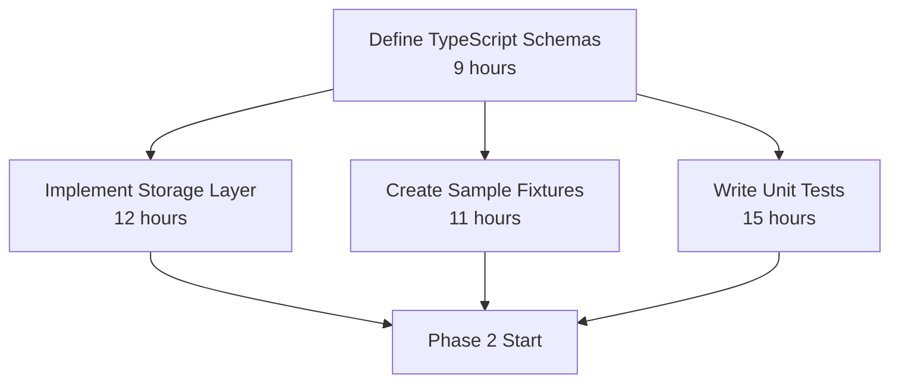
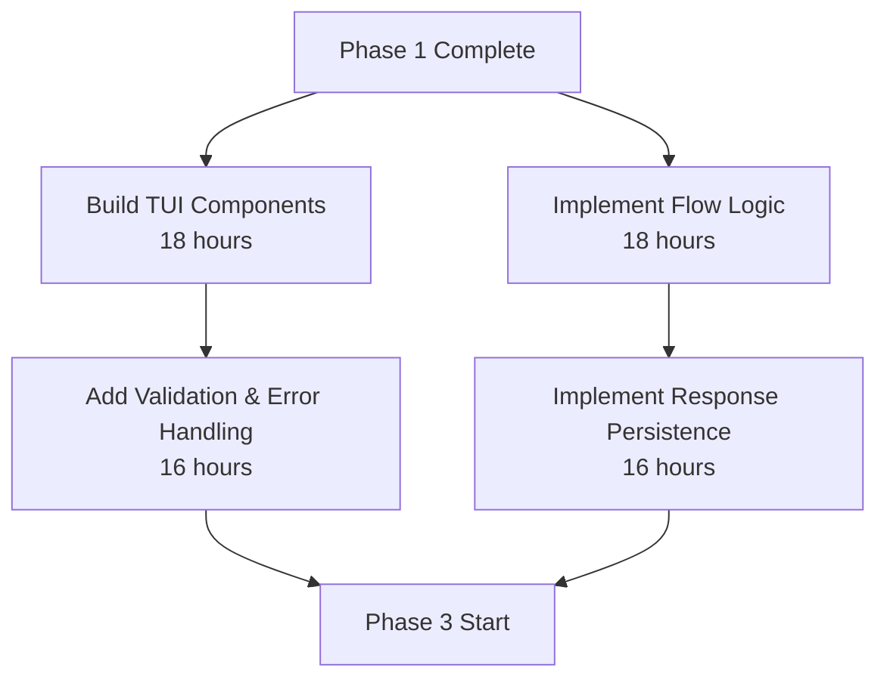
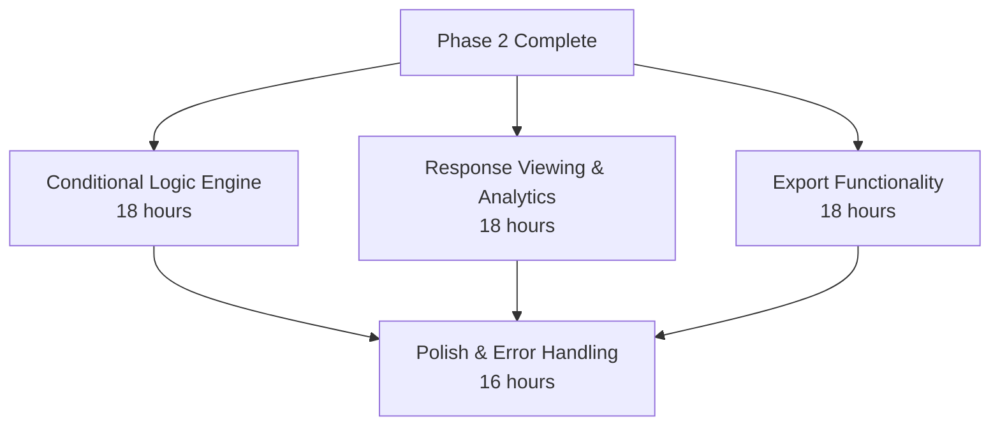

# Implementation Dependencies and Parallelization Plan

## Overview

This document outlines the dependencies between implementation tasks and provides strategies for parallel development to optimize the development timeline.

**Total Estimated Effort:** 185 hours across 3 phases  
**Sequential Timeline:** ~4.5 weeks (1 developer @ 40 hours/week)  
**Optimized Timeline:** ~2.5-3 weeks (2 developers with parallelization)

---

## Phase 1: Core Schema & Storage (Week 1)

**Total Effort:** 47 hours  
**Optimized Duration:** 25-30 hours with 2 developers

### Task Dependencies



### Dependency Details

| Task | Duration | Depends On | Can Parallel With |
|------|----------|------------|-------------------|
| **1. Define TypeScript Schemas** | 9 hours | None (foundation) | Nothing - must complete first |
| **2. Implement Storage Layer** | 12 hours | Schemas | Fixtures, Tests |
| **3. Create Sample Fixtures** | 11 hours | Schemas | Storage, Tests |
| **4. Write Unit Tests** | 15 hours | Schemas | Storage, Fixtures |

### Parallelization Strategy

**Day 1-2 (Sequential):**
- Complete Schemas (9 hours) - **CRITICAL PATH**

**Day 3-5 (Parallel):**
- **Developer A:** Storage Layer (12 hours)
- **Developer B:** Fixtures (11 hours) + start Tests (4 hours)

**Day 6-7 (Parallel):**
- **Developer A:** Complete Storage, help with Tests
- **Developer B:** Complete Tests (11 hours remaining)

### Critical Notes

- **Schemas are the foundation** - everything else depends on these type definitions
- Storage and Fixtures can proceed independently once schemas are defined
- Tests can start early by testing schema validation rules directly

---

## Phase 2: Questionnaire Runner (Week 2)

**Total Effort:** 68 hours  
**Optimized Duration:** 35-40 hours with 2 developers

### Task Dependencies



### Dependency Details

| Task | Duration | Depends On | Can Parallel With | Blocks |
|------|----------|------------|-------------------|--------|
| **1. Build TUI Components** | 18 hours | Schemas, Fixtures | Flow Logic | Validation |
| **2. Implement Flow Logic** | 18 hours | Schemas, Storage | Components | Persistence |
| **3. Add Validation & Error Handling** | 16 hours | Schemas, Components | Persistence (initially) | Phase 3 |
| **4. Implement Response Persistence** | 16 hours | Storage, Flow Logic | Validation (initially) | Phase 3 |

### Parallelization Strategy

**Week 2, Days 1-4 (Parallel):**
- **Developer A:** TUI Components (18 hours)
  - Build all question type components
  - Component factory and base classes
  - Visual styling and formatting
  
- **Developer B:** Question Flow Logic (18 hours)
  - Flow engine implementation
  - Navigation system
  - State management
  - Session handling

**Week 2, Days 5-8 (Parallel):**
- **Developer A:** Validation & Error Handling (16 hours)
  - Requires: Components completed
  - Input validation for all types
  - Cross-question validation
  - Error UI components
  
- **Developer B:** Response Persistence (16 hours)
  - Requires: Flow Logic completed
  - Response builder
  - Incremental saves
  - Session recovery

### Critical Notes

- **Components and Flow Logic** are largely independent and can be built in parallel
- **Validation needs Components** to integrate UI validation feedback
- **Persistence needs Flow Logic** to understand state and session management
- Both validation and persistence should be completed before Phase 3 starts

---

## Phase 3: Advanced Features (Week 3)

**Total Effort:** 70 hours  
**Optimized Duration:** 35-40 hours with 2 developers

### Task Dependencies



### Dependency Details

| Task | Duration | Depends On | Can Parallel With | Blocks |
|------|----------|------------|-------------------|--------|
| **1. Conditional Logic Engine** | 18 hours | Schemas, Flow Logic | Analytics, Export | Polish |
| **2. Response Viewing & Analytics** | 18 hours | Storage, Persistence | Conditional Logic, Export | Polish |
| **3. Export Functionality** | 18 hours | Storage, Persistence | Conditional Logic, Analytics | Polish |
| **4. Polish & Error Handling** | 16 hours | ALL tasks above | Nothing - integration work | Release |

### Parallelization Strategy

**Week 3, Days 1-4 (Parallel - High Independence):**
- **Developer A:** Conditional Logic Engine (18 hours)
  - Expression parser
  - Evaluation engine
  - Conditional functions
  - Dependency graph
  
- **Developer B:** Response Viewing & Analytics (18 hours)
  - Response viewing service
  - Analytics engine
  - Statistical calculations
  - Visualization components

**Week 3, Days 5-6 (Parallel/Sequential):**
- **Developer A:** Export Functionality (18 hours)
  - JSON, CSV, Excel, PDF exporters
  - Export templates
  - Export scheduling
  
- **Developer B:** Continue Analytics or start Polish prep
  - Finish analytics features
  - Begin integration testing

**Week 3, Days 7-8 (Both Developers):**
- **Both:** Polish & Error Handling (16 hours)
  - Centralized error handling
  - UX enhancements
  - Performance optimization
  - Production readiness
  - Integration testing

### Critical Notes

- **Highest parallelization potential** - Conditional Logic, Analytics, and Export are largely independent
- **Analytics depends on Response Persistence** being solid
- **Export can leverage Analytics** for richer exports
- **Polish is integration work** - best done collaboratively after all features exist

---

## Critical Path Analysis

### Overall Critical Path

The longest dependent chain through the project:

```
Schemas (9h)
  → Storage (12h)
    → Flow Logic (18h)
      → Persistence (16h)
        → Analytics (18h)
          → Export (18h)
            → Polish (16h)

Total Critical Path: 107 hours
```

### Parallel Opportunities

Tasks that can run parallel to critical path:

```
Parallel Track 1:
Schemas (9h) → Fixtures (11h) → Tests (15h) → Components (18h) → Validation (16h) → Conditional Logic (18h)

Parallel Track 2:
Schemas (9h) → Storage (12h) → Flow Logic (18h) → Persistence (16h) → Analytics (18h) → Polish (16h)
```

**Optimal Strategy:** Run 2 parallel tracks with periodic synchronization points

---

## Resource Allocation Recommendations

### Single Developer Approach

**Timeline:** 4.5-5 weeks (185 hours)

**Sequence:**
1. Week 1: Phase 1 (47 hours)
   - Day 1-2: Schemas
   - Day 3-4: Storage
   - Day 5: Fixtures
   - Day 6-7: Tests

2. Week 2: Phase 2 (68 hours, will overflow)
   - Day 1-4: Components
   - Day 5-7: Flow Logic
   
3. Week 3: Phase 2 completion + Phase 3 start
   - Day 1-3: Validation & Persistence
   - Day 4-7: Conditional Logic + Analytics start

4. Week 4: Phase 3 completion
   - Day 1-4: Complete Analytics, Export
   - Day 5-7: Polish

5. Week 5: Buffer and integration

### Two Developer Approach (Recommended)

**Timeline:** 2.5-3 weeks (100-110 hours per developer)

**Week 1:**
- **Dev A:** Schemas (9h) → Storage (12h) → Support Tests
- **Dev B:** Wait for Schemas → Fixtures (11h) + Tests (15h)

**Week 2:**
- **Dev A:** Components (18h) → Validation (16h)
- **Dev B:** Flow Logic (18h) → Persistence (16h)

**Week 3:**
- **Dev A:** Conditional Logic (18h) → Export (18h)
- **Dev B:** Analytics (18h) → Assist with Export/Polish
- **Both:** Polish (16h combined)

### Three+ Developer Approach

**Not Recommended** - Diminishing returns due to:
- High coordination overhead
- Many sequential dependencies
- Risk of integration conflicts
- Most tasks are designed for 1-2 people

**If required:**
- 3rd developer can focus on documentation, testing, and tooling
- DevOps and CI/CD pipeline setup
- Performance testing and optimization
- Additional fixture creation

---

## Risk Mitigation

### High-Risk Dependencies

1. **Storage Layer** (Phase 1)
   - Risk: Foundation for all persistence
   - Mitigation: Complete with comprehensive tests before Phase 2
   - Testing: Unit tests + integration tests with file system

2. **Flow Logic** (Phase 2)
   - Risk: Complex state management, affects multiple features
   - Mitigation: Extensive testing with fixtures, consider state machine patterns
   - Testing: State transition tests, session recovery tests

3. **Response Persistence** (Phase 2)
   - Risk: Multiple dependencies, data integrity critical
   - Mitigation: Don't start until Flow Logic is solid and tested
   - Testing: Data corruption scenarios, concurrent access tests

### Synchronization Points

**After Phase 1:**
- Team sync to review schemas and storage
- Validate fixtures work correctly
- Confirm test coverage is adequate

**Mid Phase 2:**
- After Components + Flow Logic complete
- Integration testing before starting Validation + Persistence
- Ensure Components and Flow work together

**After Phase 2:**
- Major integration checkpoint
- End-to-end testing of questionnaire execution
- Confirm all persistence scenarios work

**Mid Phase 3:**
- After Conditional Logic + Analytics complete
- Test complex conditional scenarios
- Validate analytics calculations

**Before Release:**
- Complete integration testing
- Performance testing under load
- Security review
- Documentation review

---

## Development Workflow Recommendations

### Branch Strategy

```
main
  ├── phase1/schemas (merge first)
  ├── phase1/storage (merge after schemas)
  ├── phase1/fixtures (merge after schemas)
  └── phase1/tests (merge after schemas)
  
  ├── phase2/components (merge after Phase 1)
  ├── phase2/flow (merge after Phase 1)
  ├── phase2/validation (merge after components)
  └── phase2/persistence (merge after flow)
  
  ├── phase3/conditional (merge after Phase 2)
  ├── phase3/analytics (merge after Phase 2)
  ├── phase3/export (merge after Phase 2)
  └── phase3/polish (merge last)
```

### Integration Points

**Daily:**
- Code reviews for completed tasks
- Quick sync on blockers
- Update dependency status

**Weekly:**
- Phase completion reviews
- Integration testing
- Adjust parallelization based on actual progress

**Phase Boundaries:**
- Comprehensive integration testing
- Documentation review
- Demo to stakeholders
- Go/no-go decision for next phase

---

## Success Metrics

### Phase 1 Success Criteria

- [ ] All schemas validate correctly with 100% type coverage
- [ ] Storage layer handles all CRUD operations
- [ ] Fixtures cover all question types and scenarios
- [ ] Test coverage ≥95% for schemas

### Phase 2 Success Criteria

- [ ] All question types render correctly in TUI
- [ ] Flow logic handles all navigation scenarios
- [ ] Validation catches all error cases
- [ ] Sessions persist and recover correctly
- [ ] End-to-end questionnaire completion works

### Phase 3 Success Criteria

- [ ] Complex conditionals evaluate correctly
- [ ] Analytics provide accurate insights
- [ ] All export formats work correctly
- [ ] No critical bugs or errors
- [ ] Performance is acceptable under load

### Overall Success Criteria

- [ ] All acceptance criteria met for each task
- [ ] Test coverage ≥90% overall
- [ ] No known critical or high severity bugs
- [ ] Documentation complete
- [ ] Performance benchmarks met
- [ ] Production deployment successful

---

## Appendix: Task Time Estimates

### Phase 1: Core Schema & Storage (47 hours)

| Task | Sub-tasks | Hours |
|------|-----------|-------|
| Define TypeScript Schemas | Base schemas (2h) + Question types (3h) + Questionnaire (2h) + Response (2h) | 9 |
| Implement Storage Layer | Core service (4h) + Questionnaire storage (2h) + Response storage (3h) + Session mgmt (3h) | 12 |
| Create Sample Fixtures | Basic fixtures (3h) + Advanced fixtures (4h) + Edge cases (2h) + Documentation (2h) | 11 |
| Write Unit Tests | Question schemas (6h) + Questionnaire schemas (3h) + Response schemas (3h) + Edge cases (3h) | 15 |

### Phase 2: Questionnaire Runner (68 hours)

| Task | Sub-tasks | Hours |
|------|-----------|-------|
| Build TUI Components | Base framework (4h) + Text/Input (5h) + Choice components (4h) + Specialized (5h) | 18 |
| Implement Flow Logic | Core engine (6h) + Conditional logic (5h) + Navigation (4h) + Session mgmt (3h) | 18 |
| Add Validation | Input validation (5h) + Cross-question (4h) + Error framework (4h) + Error UI (3h) | 16 |
| Response Persistence | Data model (4h) + Incremental saves (5h) + Completion (3h) + Recovery/Query (4h) | 16 |

### Phase 3: Advanced Features (70 hours)

| Task | Sub-tasks | Hours |
|------|-----------|-------|
| Conditional Logic Engine | Expression parser (6h) + Evaluation engine (5h) + Advanced features (4h) + Debug tools (3h) | 18 |
| Response Viewing & Analytics | Data access (4h) + Analytics engine (6h) + Visualization (5h) + Export/Reporting (3h) | 18 |
| Export Functionality | Core framework (4h) + Format exporters (8h) + Advanced features (4h) + Management (2h) | 18 |
| Polish & Error Handling | Error framework (5h) + UX enhancements (4h) + Performance (4h) + Production readiness (3h) | 16 |

**Total:** 185 hours

---

## Conclusion

This implementation plan balances sequential dependencies with parallel development opportunities to optimize the development timeline. With proper resource allocation and synchronization points, the project can be completed in approximately 2.5-3 weeks with two developers, compared to 4.5-5 weeks with a single developer.

Key success factors:
- **Complete schemas first** - they are the foundation
- **Respect dependencies** - don't start dependent tasks prematurely
- **Leverage parallelization** - maximize parallel work within constraints
- **Regular synchronization** - integrate frequently to catch issues early
- **Comprehensive testing** - test each component thoroughly before moving forward
